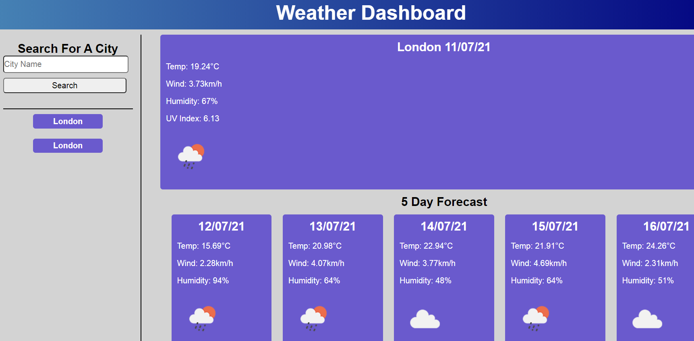

# Weather-Dashboard

## Description

[https://cleggatron.github.io/Weather-Dashboard/](https://cleggatron.github.io/Weather-Dashboard/)

This website will accept user input of a city name, and return the weather data for the day, as well as a look ahead for the following five days. Any user input will be saved in the search history, which is recorded in local storage. These items in the search history can also be clicked which will then trigger the search for these cities. 

## Installation

As this is a web based application there should be no installation required. The search history will be stored in the browser's local storage however.

## Usage

The user can input a city name into the search field. This will trigger 2 searches to data sources from [https://openweathermap.org/](https://openweathermap.org/). This will return the data for the current day, and for future days for that city. The city is saved to a search history. The data for this is held and retrieved from local storage. 

I found that there were limits to the data sources available, where searching by city would not yield all the information, but the other data source had no City Search ability. This has necessitated 2 API calls to retrieve the data for the city name, which are then plugged into the new query. This does mean that the number of API requests that cna be made (60/minute) is halved, if the site saw more usage.

Items in search history can be clicked on to trigger a search using their values. 

## Credits

This website is using the API's provided by Open Weather Map.
[https://openweathermap.org/](https://openweathermap.org/)

## License

Copyright (c) [2021] [David Clegg]

Permission is hereby granted, free of charge, to any person obtaining a copy of this software and associated documentation files (the "Software"), to deal in the Software without restriction, including without limitation the rights to use, copy, modify, merge, publish, distribute, sublicense, and/or sell copies of the Software, and to permit persons to whom the Software is furnished to do so, subject to the following conditions:

The above copyright notice and this permission notice shall be included in all copies or substantial portions of the Software.

THE SOFTWARE IS PROVIDED "AS IS", WITHOUT WARRANTY OF ANY KIND, EXPRESS OR IMPLIED, INCLUDING BUT NOT LIMITED TO THE WARRANTIES OF MERCHANTABILITY, FITNESS FOR A PARTICULAR PURPOSE AND NONINFRINGEMENT. IN NO EVENT SHALL THE AUTHORS OR COPYRIGHT HOLDERS BE LIABLE FOR ANY CLAIM, DAMAGES OR OTHER LIABILITY, WHETHER IN AN ACTION OF CONTRACT, TORT OR OTHERWISE, ARISING FROM, OUT OF OR IN CONNECTION WITH THE SOFTWARE OR THE USE OR OTHER DEALINGS IN THE SOFTWARE.
